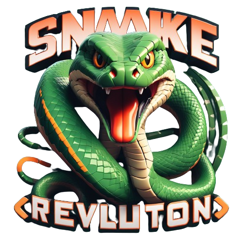

# Snake-Revolution-Game v-1



Welcome to the **Snake Revolution Game** repository! This is the first version of our project, which is part of our ongoing efforts to reinvent the classic Snake game. Our goal is to create multiple versions of Snake that differ from the traditional gameplay, reigniting interest in this nostalgic game while improving our React skills.

## Quick Test

You can quickly test the game in production on GitHub Pages: [Play Snake Revolution Game](https://your-username.github.io/Snake-Revolution-Game)

## Table of Contents

- [Snake-Revolution-Game v-1](#snake-revolution-game-v-1)
  - [Quick Test](#quick-test)
  - [Table of Contents](#table-of-contents)
  - [Project Overview](#project-overview)
  - [Features](#features)
  - [Installation](#installation)
  - [Usage](#usage)
  - [Roadmap](#roadmap)
  - [Contributing](#contributing)
  - [License](#license)
  - [Contact](#contact)

## Project Overview

The **Snake Revolution Game** is a modern take on the classic Snake game, developed using Vite, React, TypeScript, and Tailwind CSS. This first version (v-1) is responsive and can be played on various devices, including PCs, tablets, and mobile phones.

## Features

- Classic Snake gameplay with a modern twist
- Responsive design for seamless play on different devices
- Use of React, TypeScript, and Tailwind CSS for a smooth development experience
- High score tracking
- Pause functionality

## Installation

To get started with the project locally, follow these steps:

1. Clone the repository:
   ```sh
   git clone -b v-1 https://github.com/your-username/Snake-Revolution-Game.git
   ```

2. Navigate to the project directory:
   ```sh
   cd Snake-Revolution-Game
   ```

3. Install the dependencies:
   ```sh
   npm install
   ```

4. Start the development server:
   ```sh
   npm run dev
   ```

## Usage

Once the development server is running, you can open the game in your browser at `http://localhost:3000`. Use the arrow keys to control the snake and try to beat your high score!

## Roadmap

We have many exciting features planned for future versions of the **Snake Revolution Game**, including:

- New game modes
- Enhanced graphics and animations
- Additional power-ups and obstacles
- Multiplayer functionality

Stay tuned for updates!

## Contributing

We welcome contributions to the **Snake Revolution Game**. If you'd like to help out, please fork the repository and submit a pull request with your changes. Make sure to follow our coding guidelines and include a detailed description of your changes.

## License

This project is licensed under the MIT License. See the [LICENSE](LICENSE) file for details.

## Contact

For any questions or feedback, feel free to reach out:

- Email: brandoniscoding4@gmail.com
- WhatsApp: +237 620510564

Thank you for your interest in the **Snake Revolution Game**! Let's make this classic game fun again.
```

